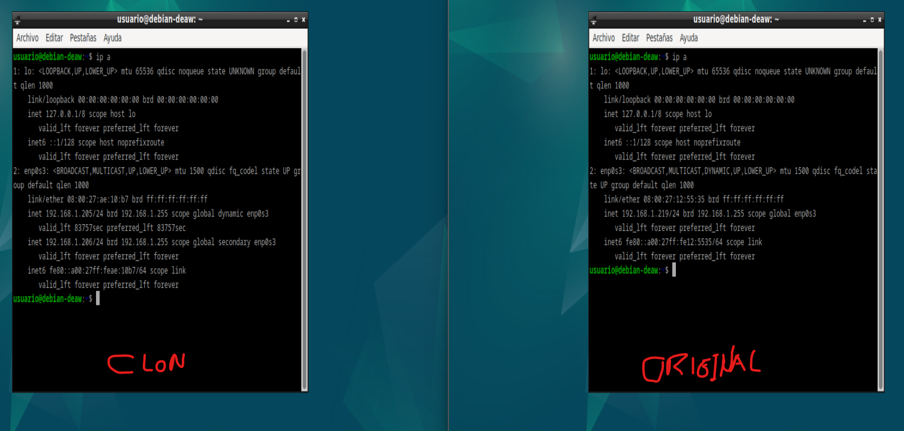
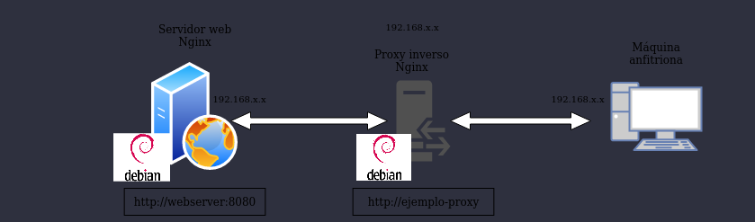
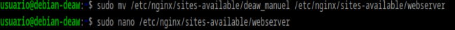
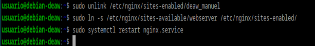
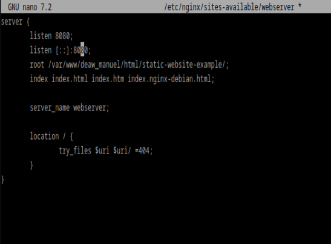
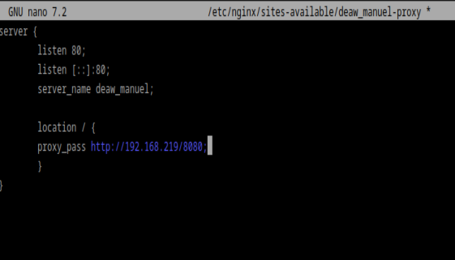
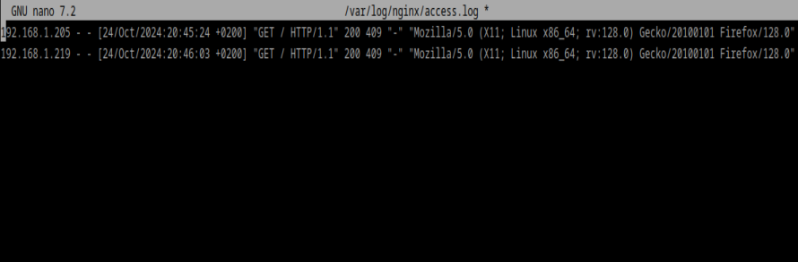
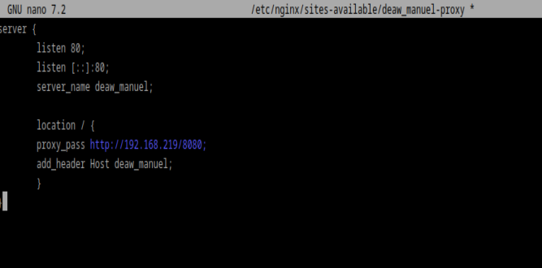
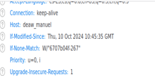

# PRÁCTICA 2.3: Proxy inverso con Nginx

En esta práctica vamos a crear un proxy inverso para nuestro servidor web.

## Configuraciones iniciales

Para comenzar vamos a duplicar nuestra maquina virtual con el servidor web (generandola con nueva MAC, si no no tendríamos ip en esta máquina):

Como podemos comprobar ambas tienen direcciones ip diferentes:

El diagrama quedaría así:

Donde la nueva máquina actua como proxy inverso.

Cambiamos el nombre de nuestra web por webserver y modificamos los archivos pertinentes:

 

## Nginx proxy inverso

Ahora, cuando intentamos acceder a http://ejemplo-proxy (o el nombre que tuvieráis de vuestra web de las prácticas anteriores), en realidad estaremos accediendo al proxy, que nos redirigirá a http://webserver:8080, el servidor web que acabamos de configurar para que escuche con ese nombre en el puerto 8080.

Para ello:

Crear un archivo de configuración en sites-available con el nombre deaw_manuel-proxy 

y hay que cambiar el archivo host que configuramos en la práctica 2.1

## COMPROBACIONES

Miramos los archivos access.log de la máquina:

Además añadimos una cabecera de la siguiente forma:

y comprobamos en el navegador que se muestra:

